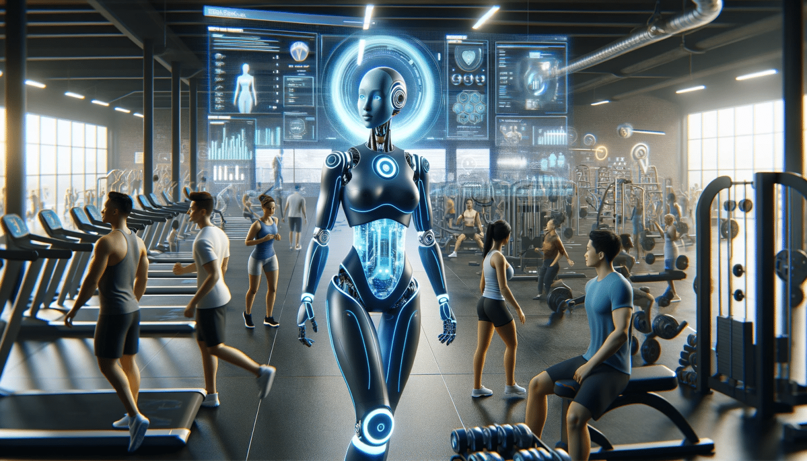

# 🏋️‍♂️ Gym Trainer AI

**Gym Trainer AI** is a real-time desktop application that uses artificial intelligence and computer vision to monitor and analyze gym workouts—specifically bicep curls. It captures live webcam input, analyzes form using AI, counts repetitions, and gives visual feedback on posture and performance.

---




---

## 🚀 Features

- 🎥 Real-time webcam capture and feedback  
- ✅ Detects bicep curl form and posture  
- 🔢 Counts repetitions  
- 📊 Scores performance (form percentage, elbow angles)  
- 🖥️ Modern, styled GUI using `tkinter` and `ttk`  
- 🧵 Thread-safe and responsive  

---

## 🛠️ Tech Stack

- Python 3.x  
- OpenCV (`cv2`)  
- Tkinter / TTK  
- Threading  
- Custom AI logic (you implement in `trainer.py`)  

---

## 📁 Project Structure

```
gym_trainer_ai/
├── gym_trainer_gui.py       # Main GUI interface
├── trainer.py               # Contains AITrainer logic (your implementation)
├── README.md                # This documentation file
├── LICENSE                  # MIT License
├── requirements.txt         # Python dependencies
└── assets/                  # (Optional) icons or banners
```

---

## ▶️ Getting Started

### 1. Clone the Repository

```bash
git clone https://github.com/your-username/gym-trainer-ai.git
cd gym-trainer-ai
```

### 2. Install Requirements

```bash
pip install -r requirements.txt
```

Or manually:

```bash
pip install opencv-python numpy
```

> Tkinter is usually pre-installed. On Ubuntu/Debian:  
> `sudo apt install python3-tk`

---

## 📄 requirements.txt

```
opencv-python
numpy
```

Add other dependencies if you use ML models or pose estimation libraries.

---

## ▶️ Running the App

Make sure you have a webcam connected.

```bash
python gym_trainer_gui.py
```

- Click **▶ Start Analysis** to begin  
- Click **■ Stop Analysis** to end  
- Or press `Q` in the video window to quit  

---

## 🧠 Expected AI Output Format

The method `analyze_frame()` in `AITrainer` (from `trainer.py`) must return:

```python
(annotated_frame, feedback_data)
```

Where `feedback_data` looks like:

```python
{
  "metrics": {
    "reps": 10,
    "form_score": 91,
    "elbow_angle": 74.2
  },
  "messages": [
    "✅ Great elbow control!",
    "⚠️ Try to slow the lowering phase.",
    "❌ Don’t swing your upper arms."
  ]
}
```

---

## ❗ Troubleshooting

| Problem                  | Fix                                               |
|--------------------------|----------------------------------------------------|
| Camera not working       | Ensure it's plugged in and not used by another app |
| GUI freezes              | Ensure threading is correctly implemented          |
| No feedback shown        | Check your `trainer.py` logic                      |
| Reps not counted         | Make sure elbow tracking is implemented            |

---

## 🤝 Contributing

You're welcome to contribute!

✅ Fork the repo  
✅ Create a new feature branch  
✅ Submit a PR

Suggestions:

- Add new exercises (e.g., squats, shoulder press)  
- Improve scoring algorithm  
- Add data logging/exporting  
- Voice feedback integration  

---

## 📜 License

```
MIT License

Copyright (c) 2025

Permission is hereby granted, free of charge, to any person obtaining a copy
of this software and associated documentation files (the "Software"), to deal
in the Software without restriction, including without limitation the rights to
use, copy, modify, merge, publish, distribute, sublicense, and/or sell copies
of the Software, and to permit persons to whom the Software is furnished to do
so, subject to the following conditions:

The above copyright notice and this permission notice shall be included in
all copies or substantial portions of the Software.

THE SOFTWARE IS PROVIDED "AS IS", WITHOUT WARRANTY OF ANY KIND, EXPRESS OR
IMPLIED, INCLUDING BUT NOT LIMITED TO THE WARRANTIES OF MERCHANTABILITY,
FITNESS FOR A PARTICULAR PURPOSE AND NONINFRINGEMENT. IN NO EVENT SHALL THE
AUTHORS OR COPYRIGHT HOLDERS BE LIABLE FOR ANY CLAIM, DAMAGES OR OTHER
LIABILITY, WHETHER IN AN ACTION OF CONTRACT, TORT OR OTHERWISE, ARISING FROM,
OUT OF OR IN CONNECTION WITH THE SOFTWARE OR THE USE OR OTHER DEALINGS IN
THE SOFTWARE.
```

---

## 🙌 Acknowledgements

- Developed as part of a university AI graduation project.
- Inspired by fitness form analysis tools.
- Thanks to open-source CV and GUI libraries.

---

## ✨ Future Work

- 🧍 Add full-body posture detection  
- 🧠 Use deep learning pose models (e.g., MediaPipe, MMPose)  
- 🔊 Add voice feedback  
- 📈 Export stats to CSV or PDF  
- ☁️ Sync workout logs online  

---
